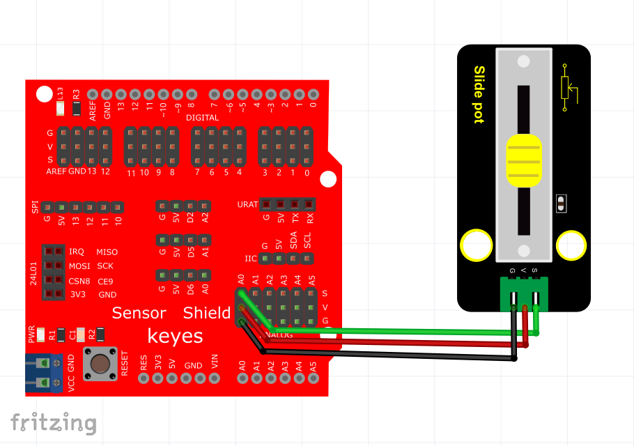

# Arduino


## 1. Arduino简介  

Arduino是一款开源电子原型平台，旨在使各种电子项目的开发变得简单且容易上手。它由一系列标准化的电路板、微控制器和软件开发环境组成，使用户能够以直观和灵活的方式进行编程和控制硬件。Arduino被广泛应用于教育、艺术、机器人、家庭自动化和物联网等多个领域。  

Arduino的特色在于其易用性和强大的社区支持，用户可以访问大量的示例代码、库和驱动，来以最少的学习曲线快速实现功能。它支持多种编程环境，包括C/C++语言的Arduino IDE和可视化编程工具如Scratch和Mixly，使得初学者和专业开发者都能胜任。  

## 2. 接线图  

  

## 3. 测试代码  

```cpp  
int sensorPin = A0; // 定义模拟口A0  
int value = 0; // 设置value为0  

void setup() {  
    Serial.begin(9600); // 设置波特率  
}  

void loop() {  
    value = analogRead(sensorPin); // 将value设置为读取到的A0的数值  
    Serial.println(value, DEC); // 显示value数值，并自动换行  
    delay(100); // 延迟0.1S  
}  
```  

## 4. 代码说明  

### 4.1 定义变量  
- `int sensorPin = A0;`：此行代码定义了一个整数类型的变量`sensorPin`，并将其赋值为模拟口A0，表示读取连接在A0口的传感器信号。  

### 4.2 初始化设置  
- `Serial.begin(9600);`：通过串口通信设置波特率为9600，这样可以在串口监视器中显示传感器的读取值。  

### 4.3 循环读取  
- `value = analogRead(sensorPin);`：调用`analogRead`函数从定义的模拟口读取数据，并将结果存储在变量`value`中。  
- `Serial.println(value, DEC);`：通过串口将读取到的值打印出来，`DEC`表示以十进制格式输出。  
- `delay(100);`：设置延迟100毫秒，以便在每个读取之间留有足够的时间。  

## 5. 测试结果  

按照接线方法接好线，并烧录好代码后，上电并打开串口监视器，设置波特率为9600。随后，用户可以通过滑动连接到模拟口A0的电位器来观察模拟值的变化，范围在0到1023之间，变化情况如如下图所示。  


