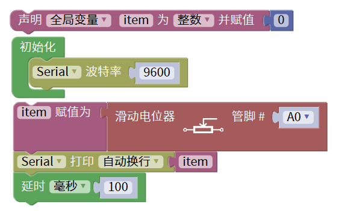
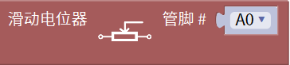
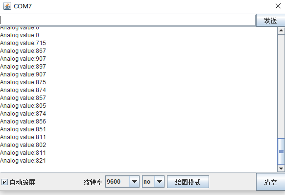

# KidsBlock

## 1. KidsBlock简介  

KidsBlock是一款专为儿童和初学者设计的可视化编程工具，旨在通过简单图形化的积木编程方式，让用户直观地学习编程和电子项目的构建。用户可以通过拖放积木的方式创建程序，这种直观的操作降低了编程的复杂性，非常适合没有编程基础的用户。KidsBlock支持多种硬件平台，包括Arduino，使得用户能够在实际的项目中应用所学到的知识。  

KidsBlock还结合了丰富的教程和示例项目，帮助用户快速上手并实现自己的创意。通过与真实硬件进行互动，KidsBlock使学习变得生动且有趣，激发孩子们的创造力和逻辑思维能力。  

## 2. 接线图  

  

## 3. 测试代码  

  

## 4. 代码说明  

### 4.1 声明变量  
在实验中，首先创建一个整数变量`item`，用于存储读取到的模拟值。  

  

### 4.2 初始化传感器  
在导入的库`keyes sensor`中找到模拟输入单元，包含模拟滑动电位器传感器模块。由于我们将传感器的脚接在模拟口A0，因此无需更改设置。  

  

### 4.3 读取值  
通过读取的模拟值将赋值给变量`item`，并在串口监视器中显示这个值，默认波特率设置为9600（可根据需要更改）。  

## 5. 测试结果  

成功接好线路并上传代码，上电后，打开Mixly的串口监视器。通过滑动电位器传感器，监视窗口中的数值会随之增大，表明传感器工作正常，监测结果如下图所示。  

