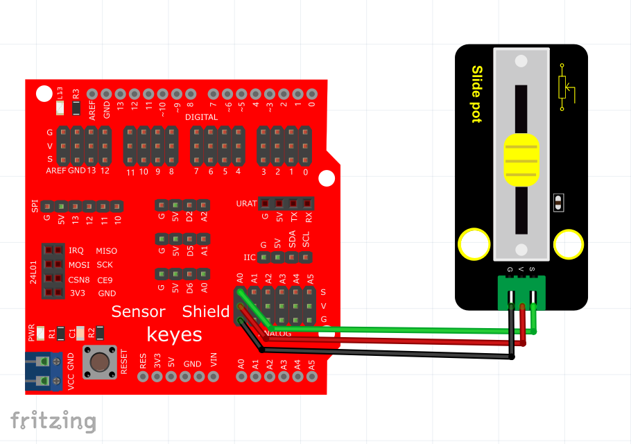
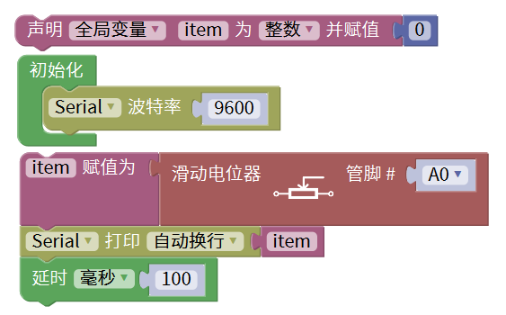
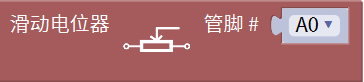
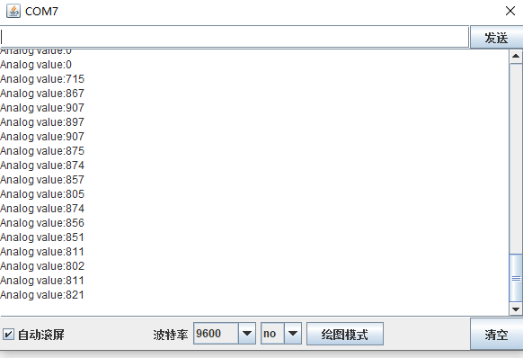

# Mixly

## 1. Mixly简介  

Mixly是一个可视化编程工具，专门为初学者和儿童设计，旨在通过简单易用的图形化界面帮助用户学习编程和电子项目的构建。用户可以通过拖放积木的方式创建程序，无需复杂的代码输入。这样一来，编程变得更具趣味性和直观性，适合没有编程基础的用户。Mixly支持与多种硬件平台（如Arduino、Raspberry Pi等）进行交互，使用户能够将其应用于创造性项目中。  

Mixly提供了丰富的示例和教程，帮助用户快速入门并实现自己的创意。它结合了友好的用户界面和详尽的学习资源，使学习编程的过程变得轻松愉快，并能够激发孩子们的创造力和逻辑思维能力。  

## 2. 接线图  

  

## 3. 测试代码  

  

## 4. 代码说明  

### 4.1 声明变量  
在实验中，创建一个整数变量`item`，用于存储读取到的模拟值。  

  

### 4.2 初始化传感器  
在导入的库`keyes sensor`下的“模拟输入”单元找到模拟滑动电位器传感器模块。由于传感器连接到模拟口A0，因此无需更改连接。  

  

### 4.3 读取值  
读取的模拟值将赋值给变量`item`，并在串口监视器中显示该值。监视器的波特率默认设置为9600。  

## 5. 测试结果  

接好线路并上传代码后，上电打开Mixly的串口监视器。通过滑动电位器传感器，可以观察到监视窗口中的数值随之增大，说明传感器正常工作，测试结果如下图所示。  

