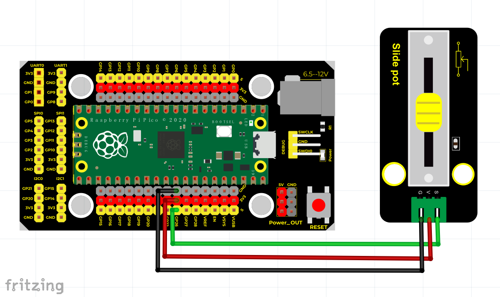
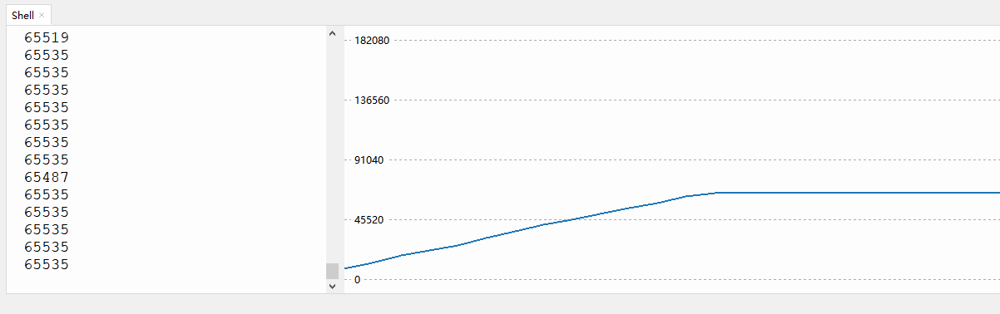

# Python

## 1. Python简介  

Python是一种高层次、通用的编程语言，以其清晰的语法和强大的功能而闻名。它适用于各种应用程序开发，包括 web 开发、数据分析、人工智能、科学计算、机器学习等。Python具有广泛的库和框架支持，如 NumPy、Pandas、Flask 和 Django，使得开发人员可以快速构建和部署应用程序。其简洁易读的代码风格，极大地降低了编程的门槛，被广泛应用于教育领域和初学者学习编程。  

在硬件编程方面，Python也有很好的支持，尤其通过MicroPython和CircuitPython等微型Python实现，允许用户在微控制器上编写Python代码，用于开发物联网（IoT）和硬件项目。通过Python，用户可以方便地与传感器、执行器和其他硬件资源进行交互，使得物理编程变得简单且直接。  

## 2. 接线图  

  

## 3. 测试代码  

```python  
import utime  

potentiometer = machine.ADC(26)  # 将GP26作为模拟信号采集引脚  

while True:  
    voltage = potentiometer.read_u16()  
    print(voltage)  # 打印模拟值  
    utime.sleep(0.1)  
```  

## 4. 代码说明  

### 4.1 导入库  
通过`import utime`导入时间库，以便后续使用延时功能。  

### 4.2 初始化传感器  
`potentiometer = machine.ADC(26)`：创建一个ADC对象，将GP26引脚配置为模拟信号输入，这里用于连接电位器。  

### 4.3 主循环  
使用`while True`创建一个无限循环，不断读取电位器的值。  

- `voltage = potentiometer.read_u16()`：读取电位器的模拟值，返回范围在0到65535之间的16位值。  
- `print(voltage)`：将读取的电压值打印到控制台。  
- `utime.sleep(0.1)`：暂停0.1秒，以便降低读取频率，防止数据混乱。  

## 5. 测试结果  

成功接好线路并上传代码后，上电并打开Thonny的显示绘图器。通过手动滑动电位器传感器，可以观察到监视窗口的数值逐渐增大，表明传感器正常工作，监测结果如下图所示。  




